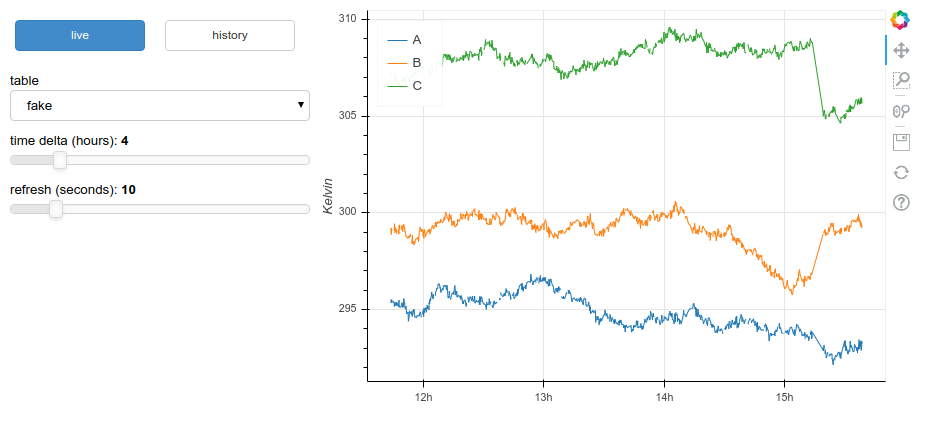

Quick Start
-----------

The `emonitor` commands can be executed from a terminal (or Anaconda prompt).

Configure the sensors for a (fake) serial device called `fake`.

.. code-block:: bash

    $ emonitor set fake --key sensors --value A B C

Next, create an SQLite database to store the fake data.

.. code-block:: bash

    $ emonitor generate fake
    Creating fake.db with columns ('A', 'B', 'C')

And finally, start the service.

.. code-block:: bash

    $ emonitor run fake --live --output --wait 10
    Starting emonitor. Use Ctrl-C to stop.

              TIMESTAMP            A	        B	        C
    2018-05-12 13:20:44	     292.7695	 293.5649	 293.9454
    2018-05-12 13:20:54	     292.9262	 293.5138	 293.9303
    2018-05-12 13:21:04	     293.0826	 293.3233	 294.0555
    2018-05-12 13:21:14	     293.1931	 293.4301	 294.0839

This queries the device for its sensor readings. Waits. And repeats.

To plot the recorded data in a browser using `bokeh <https://github.com/bokeh/bokeh>`_, launch another terminal and execute:

.. code-block:: bash

    $ emonitor plot --show

